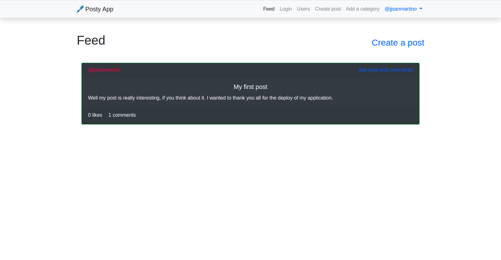

# posty-express-js

Posty is a simple application, that replicates a social network of users. You can create an account, create posts, see other users posts and profiles. Also, you can comment on posts.


## The stack
* Typescript
* Node.js
* Express.js
* MySql
* Passport.js
* Typeorm

I made this at the end of a coding bootcamp, to apply all the new concepts. It's simple, but I learned a lot. 
It has authentication, and it lacks an Error Handler. At the moment I made this I didn't know anything about error handling so I didn't implement it.


## Installation and usage
- Assuming you already have node.js, npm and docker installed, and the project cloned:
1. Install modules, and create variable configurations. The information of the .env file has to be like the info on the `docker/docker-compose.yml` file.
```bash
npm install
cp .env.example .env
```
3. Give execution permissions to the `wait-for-it.sh` script.
```bash
sudo chmod +x wait-for-it.sh
```
2. Run docker:
```bash
cd docker
docker-compose up
```

> If you want, you can use a local instance of mysql and node itself to run the proyect. I used docker just for simplicity.
